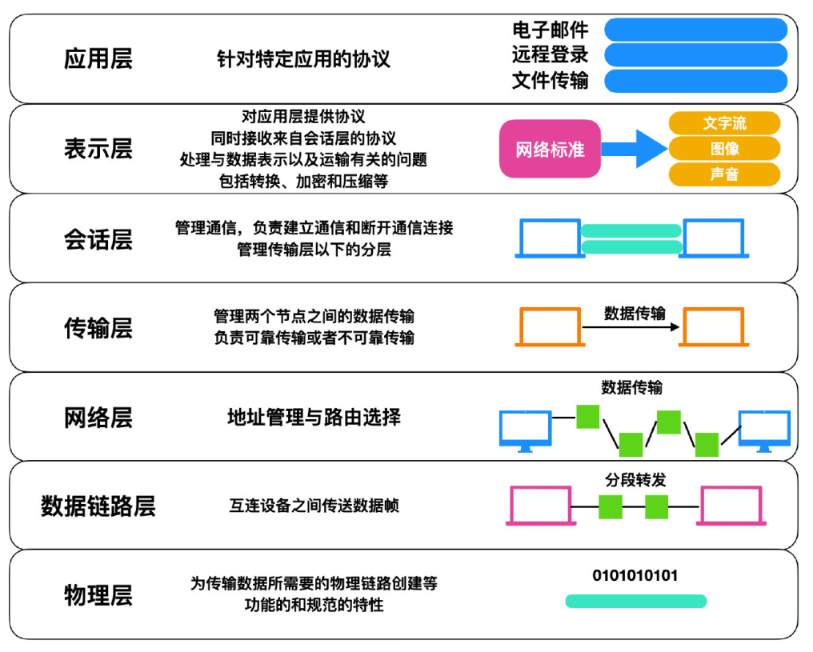
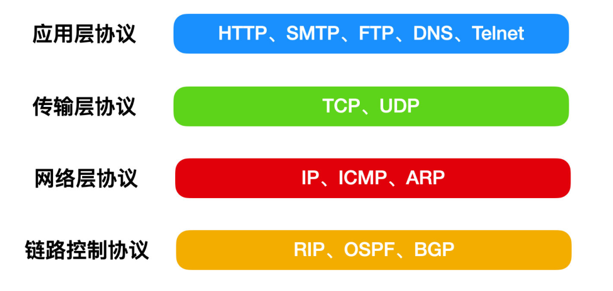
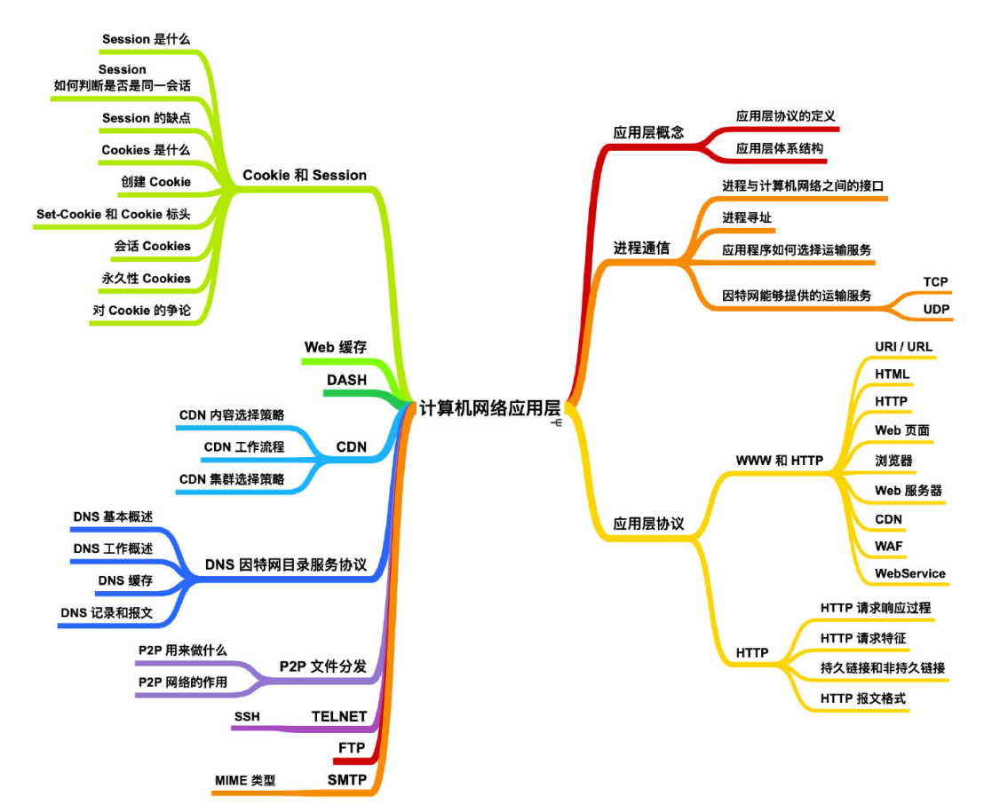
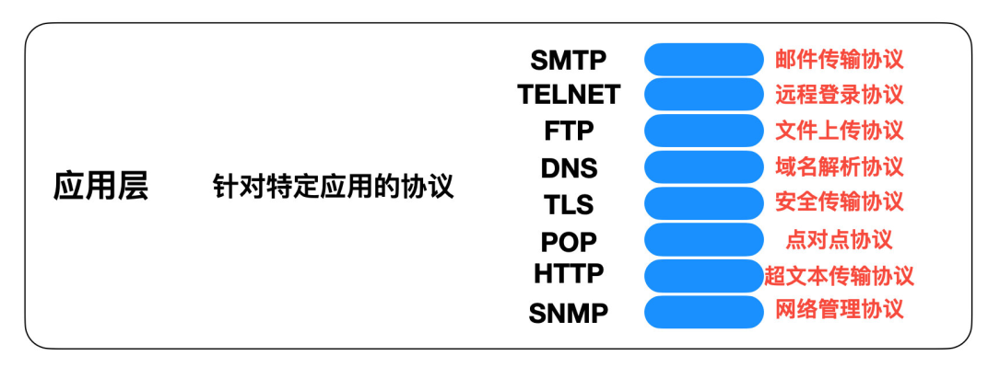

# 计算机网络基础总结

## 计算机网络概述
### 计算机网络定义

### 计算机网络分类
### ISO/OSI标准模型
ISO在制定标准化的OSI之前，对网络结构相关的问题进行了充分的探讨，最终提出了作为通信设计指标的OSI参考模型。这一模型将通信协议中必要的功能分为7层，通过这7层，使原本比较复杂的协议简单化。

互联网的通信协议都对应了7层中的某一层，通过这一点，可以了解协议在整个网络模型中的作用，一般来说，各个分层的主要作用如下：

* `应用层`：应⽤层是 OSI 标准模型的最顶层，是直接为应⽤进程提供服务的。其作⽤是在实现多个系统应⽤进程相互通信的同时，完成⼀系列业务处理所需的服务。包括⽂件传输、电⼦邮件远程登录和远端接⼝调⽤等协议。
* `表示层` : 表示层向上对应⽤进程服务，向下接收会话层提供的服务，表示层位于 OSI 标准模型的第六层，表示层的主要作⽤就是将设备的固有数据格式转换为⽹络标准传输格式。
* `会话层`：会话层位于OSI标准模型的第五层，它是建⽴在传输层之上，利⽤传输层提供的服务建⽴和维持会话。
* `传输层`
  ：传输层位于OSI标准模型的第四层，它在整个OSI标准模型中起到了⾄关重要的作⽤。传输层涉及到两个节点之间的数据传输，向上层提供可靠的数据传输服务。传输层的服务⼀般要经历传输连接建⽴阶段，数据传输阶段，传输连接释放阶段3个阶段才算完成⼀个完整的服务过程。
* `⽹络层`：⽹络层位于 OSI 标准模型的第三层，它位于传输层和数据链路层的中间，将数据设法从源端经过若⼲个中间节点传送到另⼀端，从⽽向运输层提供最基本的端到端的数据传送服务。
* `数据链路层` ：数据链路层位于物理层和⽹络层中间，数据链路层定义了在单个链路上如何传输数据。
* `物理层` ：物理层是 OSI 标准模型中最低的⼀层，物理层是整个 OSI 协议的基础，就如同房屋的地基⼀样，物理层为设备之间的数据通信提供传输媒体及互连设备，为数据传输提供可靠的环境。
### 计算机网络的性能指标
#### 速率
#### 带宽
#### 吞吐量
#### 时延
#### 时延带宽积
#### 往返时间
#### 利用率
#### 丢包率

## TCP/IP协议族

### 应用层
应用层包括OSI标准模型的会话层、表现层、应用层。

#### 应用层协议

**应用层协议（Application Layer protocol）** 定义了在不同端系统上的应用程序进程如何进行传递报文。一般会定义以下内容：
* 交换的报文类型：请求报文还是响应报文。
* 报文字段解释：对报文中的各个字段的详细解释。
* 报文字段的语义：报文中各个字段的含义是什么。
* 进程何时、以什么方式发送报文以及响应。
#### 应用层体系结构
**应用层体系结构（Application Architecture）**，一般分为两种主流体系：
* 客户-服务器体系结构（Client-Server Architecture),主要采用HTTP、
* 对等体系结构 ( P2P architecture )，主要采用`BitTorrent`协议
### HTTP协议
### DNS 协议
### FTP 协议
### SMTP 协议
### Telnet 协议
### 传输层
### 网络层

### 链路控制层
