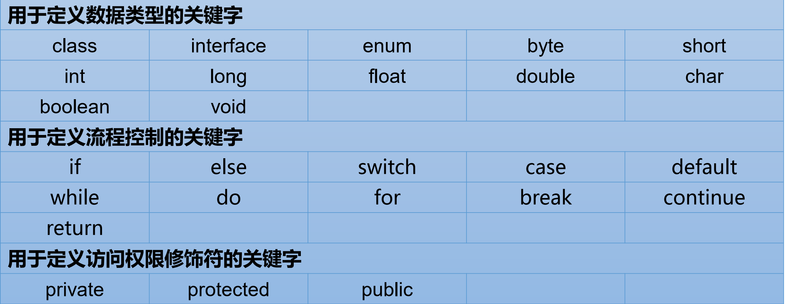
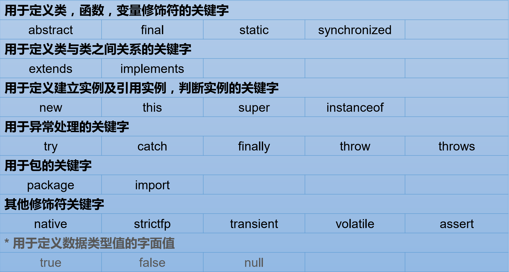
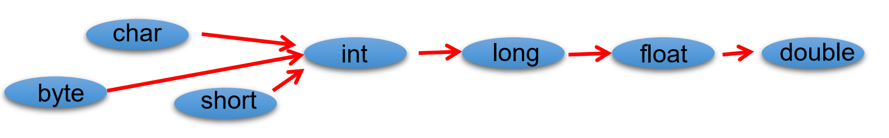
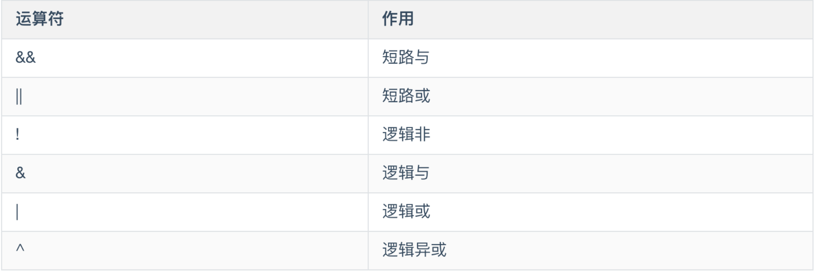
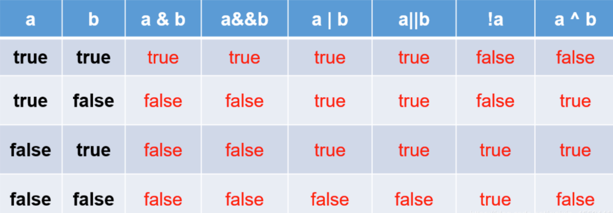

# Java 核心技术总结-基础语法
## 关键字
关键字：被Java语言赋予特殊含义，用作专门用途的字符串。


## 保留字
保留字：先有Java版本中暂未使用，但以后可能作为关键字使用。
goto、const
## 标识符
标识符是指 Java 对各种变量、方法、类等要素命名时使用的字符序列。
标识符的合法定义规则：
* 由26个英文字母大小写，0-9，_或$组成
* 数字不可以开头
* 不可以迟永关键字和保留字，但能包含关键字和保留字
* Java中严格区分大小写，长度无限制
* 标识符不能包含空格

Java中的名称命名规范:
* 包名：所有字母小写，如：xxxyyyzzz
* 类名、接口名：大驼峰命名，如：XxxYyyZzz
* 变量名、方法名：小驼峰命名，如：xxxYyyZzz
* 常量名：所有字母大写，多个单词用下划线隔开，如：XXX_YYY_ZZZ
## 基础数据类型
在Java中，数据类型只有`四类八种`。
* 整数型

**byte**,一个字节，1byte=8bits,byte的默认值为0
**short**,2个字节，1short=16bits,short的默认值为0
**int**,4个字节，1int=32bits,int的默认值为0
**long**,8个字节，1long=64bits,long的默认值为0L

* 浮点型

**float**,单精度浮点型，4个字节，1float=32bits,float的默认值为0.0f
**double**,双精度浮点型，8个字节，1double=64bits,double的默认值为0.0d

* 字符型

**char**,2个字节，1char=16bits,char的默认值为`\0000`,也就是0对应的字符
* 布尔型
  **boolean**,1boolean=8bits,boolean的默认值为false
### 自动类型转换
* 自动类型转换：容量小的类型可自动转换为容量大的类型。

* 多种数据类型混合运算时，系统将所有数据转换为容量最大的数据类型再进行计算。
* byte、short、char之间不会互转，计算时先转为int类型。
* boolean类型不与其他数据类型运算。
* 所有基础数据类型与字符串相加是，基础数据类型自动转为字符串类型。

### 强制类型转换
* 强制类型转换：自动类型转换的逆过程，通常使用强制类型转换符`（）`,可能造成精度丢失，需格外注意。
* 通常字符串不能直接转换为基础数据类型，可通过基础数据类型的包装类实现。
```
String a="43";
int i =Integer.parseInt()
```
## 运算符
* 赋值运算符：`=`
* 算数运算符：`+`、`-`、`*`、`/`
优先级：先乘除后加减，（）优先级最高。
* 自增、自减运算符：`++`、`--`
```
int i=1;
int j=i++;//先用i计算，然后给i赋值为i+1，即j=1,i=2
```
```
int i=1;
int j=++i;//先给i+1，然后用i计算，即j=2,i=2
```
* 比较运算符：`>`、`<`、`>=`、`<=`、`==`、`!=`
* 逻辑运算符：`&&`、`||`、`!`、`&`、`|`、`^`

下面是逻辑运算符对应的true/false符号表：

* 按位运算符
* 移位运算符：`>>`、`<<`
移位运算符用来将操作数向某个方向移动指定的二进制位数。
```
eg: 8>>1=4
eg: 9<<2=36
```
* 三元运算符
语法规则；**条件表达式？表达式1：表达式2**，如果条件表达式结果为true，则执行表达式1，负责执行表达式2。
## 程序流程控制
### 条件语句
* if 条件语句
```
int a = 10;
if(a > 10){
    return true;
}
return false;
```
* if...else 条件语句
```
int a = 10;
int b = 11;
if(a >= b){
    System.out.println("a >= b");
}else{
    System.out.println("a < b");
}
```
* if...else if 多条件语句
```
int x = 40;
if(x > 60) {
  System.out.println("xጱ꧊य़ԭ60");
} else if (x > 30) {
  System.out.println("xጱ꧊य़ԭ30֕ੜԭ60");
} else if (x > 0) {
  System.out.println("xጱ꧊य़ԭ0֕ੜԭ30");
} else {
  System.out.println("xጱ꧊ੜԭᒵԭ0");
}
```
* switch 多分支语句
```
switch (week) {
  case 1:
    System.out.println("Monday");
    break;
  case 2:
    System.out.println("Tuesday");
    break;
  case 3:
    System.out.println("Wednesday");
    break;
  case 4:
    System.out.println("Thursday");
  break;
  case 5:
    System.out.println("Friday");
    break;
  case 6:
    System.out.println("Saturday");
    break;
  case 7:
    System.out.println("Sunday");
    break;
  default:
    System.out.println("No Else");
    break;
}
```
### 循环语句
* for 循环

语法规则：
```
for(初始化;条件表达式;步进器){
   代码逻辑
}
```
* for-each 循环
JDK1.5版本引入了更加方便对集合、数组遍历的for-each方法。
```
int array[] = {7, 8, 9};
for (int arr : array) {
  System.out.println(arr);
}
```
* while 循环

语法规则：
```
while(布尔表达式){
  代码逻辑
}
```
* do...while 循环
```
int b = 10;
// do···while循环
do {
  System.out.println("b == " + b);
  b--;
} while(b == 1);
```
### 跳转语句
* break 语句
用法：在循环语句中，中断循环。
```
for(int i = 0;i < 10;i++){
  if(i == 5){
    break;
  }
}
```
* continue 语句
用法：用在循环语句中，中断本次循环，进行下一次循环
```
for(int i = 0;i < 10;i++){
  System.out.printl(" i = " + i );
  if(i == 5){
    System.out.printl("continue ... ");
    continue;
  }
}
```
* return 语句
用法：用在方法中，从一个方法返回，并将控制权交给调用它的语句。
```
public void getName() {
  return name;
}
```

