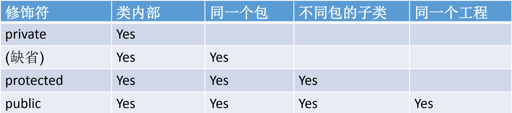

# Java 核心技术总结-面向对象编程

## 面向对象与面向过程
### 面向对象
**面向对象** 是一种以对象为基础，以事件或消息来驱动对象执行处理的程序设计技术。它具有抽象性、封装性、继承性及多态性。
### 面向过程
**面向过程(Procedure Oriented)** 是一种以过程/函数为中心的编程思想。

### 面向过程与面向对象的区别
* 从设计思路来看。
    * 面向过程：程序设计的重点是分析解决问题的步骤，以及完成步骤的流程，是一种结构化自上而下的程序设计方法。
    * 面向对象：程序设计的重点是把构成问题的事物分解成对象，从局部着手，通过迭代的方式逐步构建出整个程序，是一种以数据为核心，以类设计为主的自下而上的程序设计方法。
* 从适用范围来看。
  * 面向过程：由于不涉及实例化对象等操作，程序性能更高，开销更少，因此像切入式等对资源要求较高的系统大多都采用面向过程开发。
  * 面向对象：由于其抽象、封装、继承、多态的特性，使得系统具有更好的扩展性、维护性、复用性，对于功能复杂且维护成本较高的系统采用面向对象的开发。
* 从代码复用来看。
  * 二者都可以实现代码复用，但是面向过程主要是函数，而面向对象主要是类。
## 类
### 类的组成部分之
### 类的加载过程
## 类与对象
### 包
为了更好的组织类，Java提供了包机制，用于区分类名的命名空间。
* 定义类的所属包名
  规则：在Java文件最上方加入package 语句
```java
package  com.wusuiwei.java;//定义类的所属包名
public class Demo1 {
    int value = 0;
}
```
* 类中导入所需类
```java
package  com.wusuiwei.java;

import java.util.Date;//导入所需类

public class TestDemo {
    public static void main(String[] args) {
        Date date = new Date();
        System.out.println(date.getTime());
   }
}
```
* 类中静态导入所需类
```java
package com.wusuiwei.java;

import static java.lang.Math;//静态导入所需类

public class TestDemo {
    public static void main(String[] args) {
        double x = 30;
        double y = 40;
        // 静态导入的方式写起来更方便一些. 
        // double result = Math.sqrt(Math.pow(x, 2) + Math.pow(y, 2));
        double result = sqrt(pow(x, 2) + pow(y, 2));
        System.out.println(result);
    }
}
```
## 类
### 类的访问控制
### 抽象类
### final关键字
### 类名命名规则
### 继承
### 接口实现
### 属性、方法、内部类的访问控制
### 属性
* 属性的定义
* 属性的访问控制
* 静态变量
* 常量定义

### 属性

### 类的访问权限
### 类的属性

### 类的方法
### 类的代码块
### 类的内部类

## 对象
### 对象的创建与使用

## 面向对象的三大特征
### 封装
**封装** 是指利用抽象数据类型将数据和基于数据的操作封装在一起，使其构成一个不可分割的独立实体，数据被保护在抽象数据类型的内部，尽可能地隐藏内部的细节，只保留一些对外接口使之与外部发生联系。系统的其他对象只能通过包裹在数据外面的已经授权的操作来与这个封装的对象进行交流和交互。
#### 类的访问控制
对于Class的权限修饰符只可以使用public和default(缺省)。
- public 修饰的类可以在任意地方被访问。
- default修饰的类只可以被同一个包内部的类访问。
#### 类的属性、方法、内部类的访问控制
Java提供了权限修饰符public、protected、（缺省）、private用于类的属性、方法、内部类的访问控制。


### 继承
继承就是子类继承父类的特征和行为，使得子类对象（实例）具有父类的实例域和方法，或子类从父类继承方法，使得子类具有父类相同的行为。Java继承是**单继承**和**多层继承**。
语法规则：class SubClass **extends** SuperClass{}
#### 方法的重写（override/overwrite)
* 要求
  * 子类重写的方法必须和父类被重写的方法具有相同的方法名称和参数列表
  * 子类重写的方法返回值不能大于父类被重写的方法返回值类型
  * 子类重写的方法的访问权限不能小于父类被重写的方法访问权限
    * 子类不可重写父类的private权限的方法
    * 子类不可重写父类被static修饰的方法
  * 子类重写的方法抛出的异常不能大于父类被重写的方法抛出的异常
```java
class Fruit {
  public void eat(){
    System.out.printl('eat fruit');
  }
}
class Apple extends Fruit{
  @Override
  public void eat(){
    System.out.printl('eat apple');
  }
}
```
#### super 关键字

* super 用于访问父类中定义的属性
```java
class Animal {
    String color = "白色";
}

class Dog extends Animal {
    String color = "黑色";

    void printColor() {
        System.out.println(color);
        System.out.println(super.color);
    }
}
```
* super 用于访问父类中定义的方法
```java
class Animal {
    void eat() {
        System.out.println("吃...");
    }
}

class Dog extends Animal {
    @Override
    void eat() {
        System.out.println("吃...");
    }

    void bark() {
        System.out.println("汪汪汪...");
    }

    void work() {
        super.eat();
        bark();
    }
}  
```
* super 用于子类构造器中调用父类的构造器
```java
public class ReferParentConstructor {
    public static void main(String[] args) {
        new Dog();
    }
}

class Animal {
    Animal(){
        System.out.println("动物来了");
    }
}

class Dog extends Animal {
    Dog() {
        super();
        System.out.println("狗狗来了");
    }
}
```
输出结果：
```
动物来了
狗狗来了
```
子类构造器默认都会访问父类的无参构造器
```java
public class ReferParentConstructor {
    public static void main(String[] args) {
        new Dog();
    }
}

class Animal {
    Animal(){
        System.out.println("动物来了");
    }
}

class Dog extends Animal {
    Dog() {
        System.out.println("狗狗来了");
    }
}
```
输出结果：
```
动物来了
狗狗来了
```
当父类中没有无参构造器时，子类的构造器可以通过this(参数列表)或super(参数列表)语句指定本类或者父类中的相应构造器，只能“二选一”，且必须放在构造器首行。如果父类没有无参构造器，则不可使用super()。
```java
public class MyTest {
     
    public static void main(String[] args) {
        new Cat(); 
    }
}
 
//父类，Animal类
class Animal {
    //构造函数
    public Animal() {
        System.out.println("1：Animal类的无参数构造函数执行");
    }
    public Animal(int i) {
        System.out.println("2：Animal类的有int参数构造函数执行");
    }
}
 
//子类，Cat类
class Cat extends Animal{
    //构造函数
    public Cat() {
        this("");
        System.out.println("3：Cat类的无参数构造函数执行");
    }
    public Cat(String str) {
        super(5);
        System.out.println("4：Cat类的有String参数构造函数执行");
    }
}
```
输出结果：
```
2：Animal类的有int参数构造函数执行
4：Cat类的有String参数构造函数执行
3：Cat类的无参数构造函数执行
```
### 多态

#### 应用类型转换


## 原理解析
### 原理：类的加载过程
### 原理：对象的创建过程


